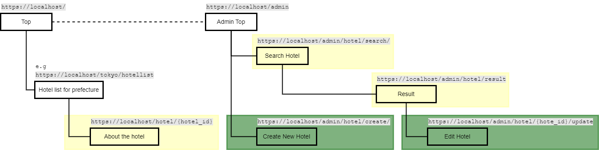
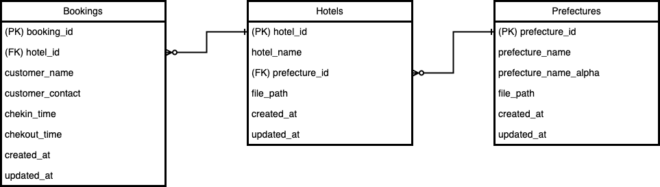

## Implementation fields

### Required field

#### overview

- you will implement to make new features for green part.
- you will implement to edit the features for yellow part.

1. **Implementing of creation a new hotel feature (for admin screen)**

    Currently, the link of hotel creation page is located in the side menu of the admin screen.

    Please create a hotel creation screen to add hotel information to be displayed in the hotel list on the user screen.

    And also, set appropriate validations for each form.

    We do not specify form items, validation rules, or validation error contents.
    Please create the forms that you think are necessary for the hotel creation page and the appropriate validation for each form.
<br>

2. **Implementation of hotel information edit feature (for admin screen)**

    Currently, an edit button is installed in each hotel information displayed on the hotel search results screen.

    Create a feature that allows you to click this edit button to go to the hotel's edit screen and edit the information below.

    ```
      ・Hotel name
      ・Prefecture to which the hotel belongs
      ・Hotel image (*optional)
    ```

    If you wish to implement hotel images, please set the upload destination for new hotel images under `entry_exam/public/assets/img/hotel`.

    When creating an editing feature, please follow the page transition below.

    ```
      1. Input screen for edit content
      2. Confirmation screen for edit content
      3. Completion screen for edit content
    ```
<br>

3. **Implementation of hotel information delete feature (for admin screen)**

    Currently, an delete button is installed in each hotel information displayed on the hotel search results screen.

    Create a feature that deletes hotel information by clicking the delete button displayed in the search results screen.

    In addition, use JavaScript to display a pop-up window asking if you really want to delete the hotel information, and then execute the deletion process if you select "OK" on the pop-up window.
<br>

4. **Bug fix, Modification and addition of hotel search function (for admin screen)**

    1. **Bug fix**

    Currently, if you press the "Search" button on the hotel search screen without entering anything in the form, an error will occur.
    Please fix the bug so that if nothing is entered in the form, "何も入力されていません" is displayed in red in the space directly below the form.

    2. **Modify search feature**

    Currently, hotel name searches are performed using exact string matches.
    Therefore, please modify the search results so that hotels whose hotel names include the string entered in the form will be displayed in the search results.

    3. **Add search feature**

    Currently, you can only search by hotel name.
    In addition, please make it searchable by the name of the prefecture the hotel is located in.
    Also, please use the select box in the search form for prefecture names.

### Optional field (Additional point for each)

1. **Considering responsive design**
<br>

2. **Implementing part of hotel booking feature (for admin screen)**

    1. **Creating a `bookings` table**
    Create a DB table `bookings` by creating migration file.
    Follow below for `bookings` table's information.
    <br>

    

    <br>
- (PK) booking_id - bigint
- (FK) hotel_id - bigint
- customer_name - varchar(255)
- customer_contact - varchar(255)
- chekin_time - timestamp
- checkout_time - timestamp
- created_at - timestamp
- updated_at - timestamp
    <br>
    This `bookings` table is a table that manages information when customers make accommodation bookings for hotels whose information is listed on this site.
    <br>

    2. **Setting up a link to booking information search screen**
    Place a link labeled "予約情報検索" in the side menu.
    <br>

    3. **Implement booking search feature**
    When you press the "予約情報検索" link, you should be directed to a screen (booking information search screen) where you can search for booking information for customers staying at the hotel.
    On the screen, please prepare a form so that you can search for booking information using the following items.
    <br>
    ・顧客名 (customer name)
    ・顧客連絡先 (customer contact information)
    ・チェックイン日時 (check-in time)
    ・チェックアウト日時 (check-out time)
    <br>
    In addition, display the following items in the search results list for reservation information.
    <br>
    ・顧客名 (customer name)
    ・顧客連絡先 (customer contact information)
    ・チェックイン日時 (check-in time)
    ・チェックアウト日時 (check-out time)
    ・予約日時 (created_at)
    ・情報更新日時 (updated_at)
    <br>
    As for the design of the booking information search screen, you can use the hotel search results screen as a reference, or you can create your own design.
    <br>
    To register data in the bookings table, manually execute the appropriate SQL or use a seeder to input the data.

### Tips for implementations

- Reflecting CSS styles

A scss file will be automatically compiled into css by the Vite server by referencing it in the blade file as shown below.

e.g. `entry_test/entry_exam/resources/views/user/home.blade.php`
```
@section('custom_css')
    @vite('resources/scss/user/home.scss')
@endsection
```

A css file can also be reflected on the screen using the same description.
```
@section('custom_css')
    @vite('resources/css/user/home.css')
@endsection
```

reference: https://readouble.com/laravel/11.x/ja/vite.html
