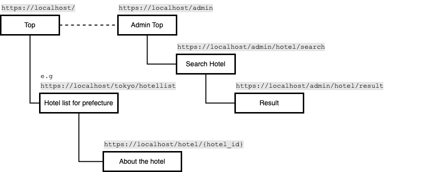
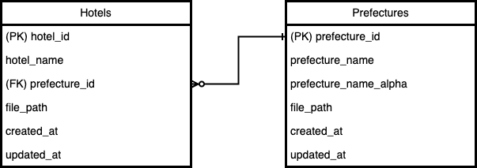
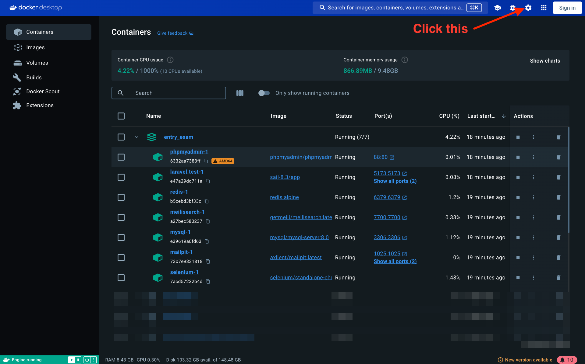
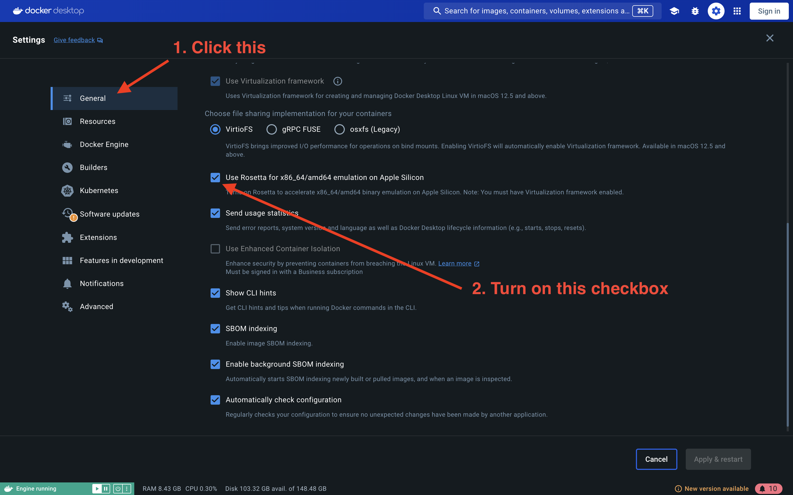
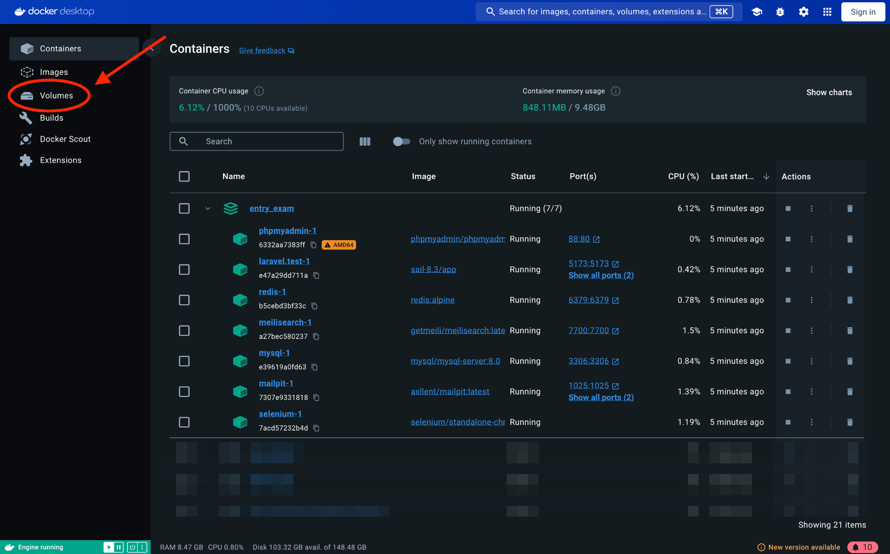
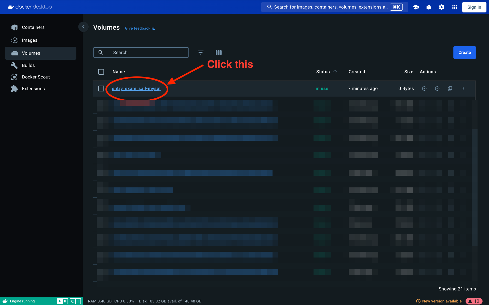
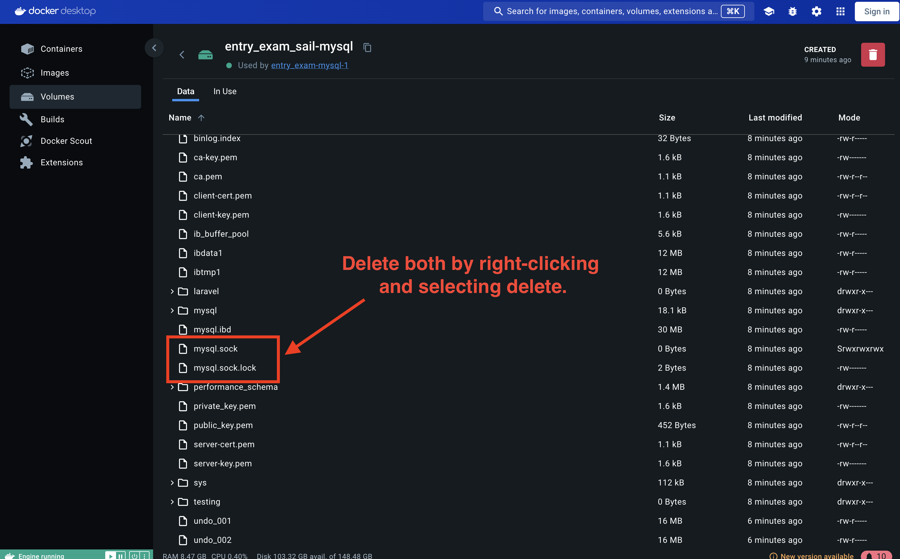

## Application's information


- Application Name: Entrance_Exam
- Laravel Version: 11.28.1
- PHP Version: 8.3.12
- Application URL: http://localhost
- phpMyAdmin URL: http://localhost:88
  - username: `sail`
  - password: `password`

### Overview

This application is a simple site for the THK Holdings Vietnam in Hanoi entrance exam that imitates accommodations site.

The application design pattern uses a simple MVC architecture.


<br>
__This is the screen flow diagram for the current state of this application.__

Please modify and add functionality to this application according to the [implementation field](./IMPLEMENTATION_FIELD.md) statement later.


<br>
__This is the ER diagram for the current state of the application.__

※About [prefecture](https://en.wikipedia.org/wiki/Prefectures_of_Japan)

### How to build this environment

[for Windows](./BUILDING_ENV_FOR_WINDOWS.md)

[for MacOS](./BUILDING_ENV_FOR_MAC.md)

### Tips

- When you handle mysql DB data

    Try access http://localhost:88.
    And CRUD operations can be performed on the GUI.

### Troubleshooting
- Laravel Sail doesn't work properly.

    Please refer to [the official Laravel Sail documentation](https://readouble.com/laravel/11.x/en/sail.html#:~:text=Rebuilding%20Sail%20Images) and try the following steps in sequence:
    ```
    docker compose down -v
    ./vendor/bin/sail build --no-cache
    ./vendor/bin/sail up
    ```

- Docker container does not start due to computer architecture compatibility. (Only for MacOS and Apple Silicon CPU)
    1. Following [docker docs](https://matsuand.github.io/docs.docker.jp.onthefly/desktop/mac/apple-silicon/#system-requirements), execute below in MacOS terminal.
    ```
    /usr/sbin/softwareupdate --install-rosetta
    ```
    2. Open Docker Desktop and check the option "Use Rosetta for x86_64/amd64 emulation on Apple Silicon".
    
    
    3. Click "Apply & restart" on the docker screen below.

- MySQL can't connect to this application.

    The mysql port number used by this application may be conflicting with the port on your PC.
    Please execute below in Ubuntu terminal.
    ```
    sudo lsof -nP -i4TCP:3306
    COMMAND     PID   USER   FD   TYPE             DEVICE SIZE/OFF NODE NAME
    xxxxxxxxx  {PID} xxxxxx  xxxx  IPv6 xxxxxxxxxxxxxxxxxx      xxx  TCP *:3306 (LISTEN)
    ```

    If you run the above command and port details are displayed, you refer to the PID part and excute the follwing.
    ```
    sudo kill {PID}
    ```
    *When you execute the command, terminal ask the password. The password is the same password with initial setup for Ubuntu.

    Then, try to run following below steps at `entry_exam` directory using `Ubuntu terminal:`
    ```
    docker compose down -v
    ./vendor/bin/sail build --no-cache
    ./vendor/bin/sail up
    ```

    Or try this:

    1. Open docker desktop and Click "Volumes" tab on the left navigation.
    
    2. Right Click "entry_exam_sail-mysql" in the "Name" list.
    
    3. Scroll to bottom and right-click both files "mysql.sock" and "mysql.sock.lock" to delete.
    
    4. Execute below steps at `entry_exam` directory.
    ```
    ./vendor/bin/sail down
    ./vendor/bin/sail up
    ```
